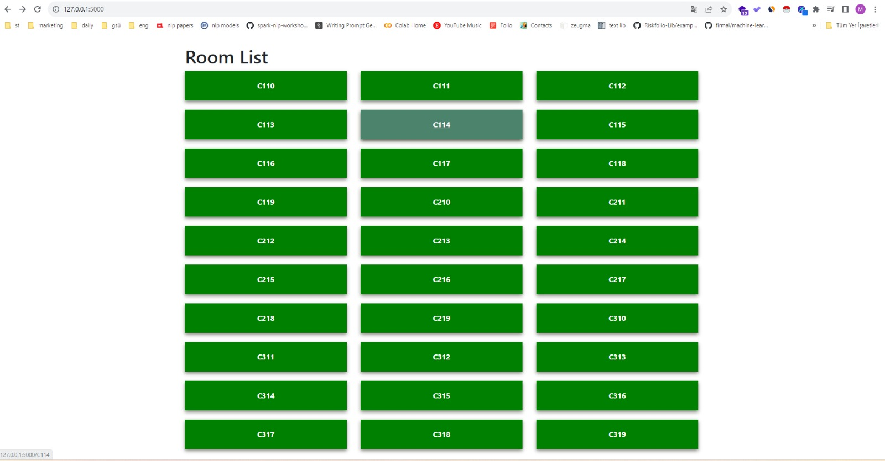
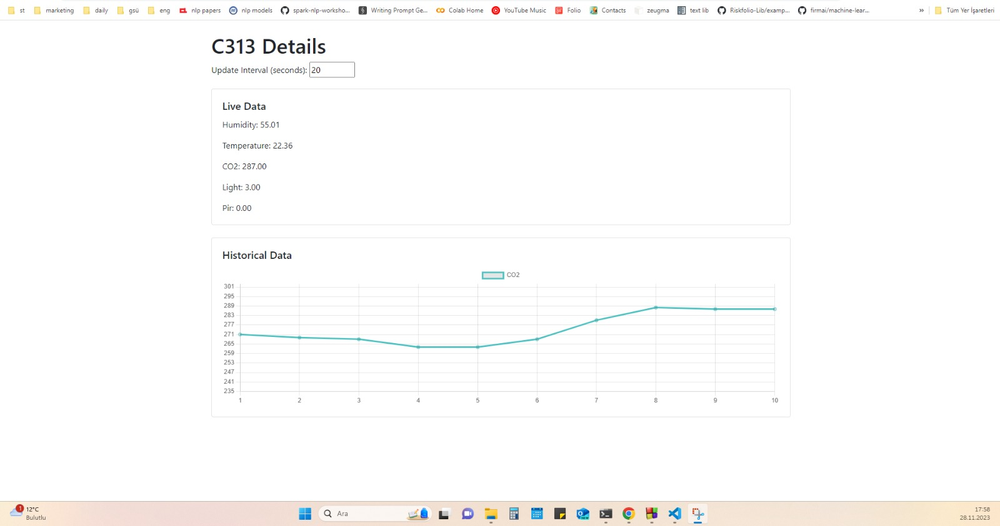

# websocket-example

An app that simulates an IoT ecosystem. The server-side was written in C. It functions by periodically reading data from five different sensors across 30 different rooms. The server aggregates this data and sends it through a WebSocket. I developed a middleware that listens to the socket, and when new data arrives, it sends this information to the web application. The web app is written using Flask, JavaScript, and HTML. It lists the available rooms on the home page, and the room detail page displays the latest data of the selected room, including a real-time updating CO2 chart. 

Follow these steps to run locally: 
1) Run the web app  
2) Run the consumer side  
3) Run the server finally  

   </img>
   </img>

